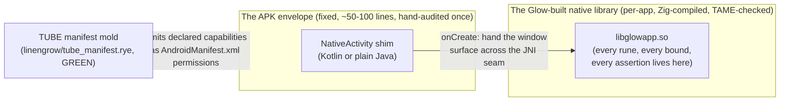

# The native-activity shim: why Glow skips Kotlin and packages native code instead

**Stamp:** `20260717.014522` · voice Quin, Keaton co-author.

**Status:** Mixed register (Two Rooms) — design decision seated `20260717.014522`; host-side TUBE0.5 packaging **checkable and GREEN** as of `20260717.021857` (permission emission, NativeActivity envelope emission, signed APK with `libglowapp.so`). On-device install and a real Glow fold inside `ANativeActivity_onCreate` remain vision / next slice.

## The question this answers

Keaton asked it plainly: should Glow grow a DSL-with-runes that transpiles to Kotlin for SLC apps, or is there a more TAME-guided way to get a bounded, explicit application onto a real Android/GrapheneOS device? This brief names the answer and the architecture it points toward.

## The decision: no Glow-to-Kotlin/JVM transpiler

Glow's Android path already exists, and it is already native. Zig cross-compiles Rye straight to `aarch64-linux-android` and `x86_64-linux-android` — real bionic-libc ELF binaries, not bytecode. `tools/hawm1_sala_witness.rish` proves this today: the Sala B0 witness runs inside a real, KVM-booted Android userland with its session root byte-identical to the native reference. `tools/hawm3_sala_device_witness.rish` carries the same claim onto the physical Pixel 10a's own Tensor G4.

A Kotlin/JVM target would ask Glow to build and prove an entire second compilation backend, then fight the JVM's own runtime on every TAME Guidance rule that already matters:

| TAME rule | What the JVM brings | Why this is a fight, not a feature |
|---|---|---|
| Bounds on everything, named ceilings | A garbage collector with its own pause and allocation behavior | Bounding an app's memory now means bounding a runtime Glow doesn't control |
| No hidden allocation | Autoboxing, collection growth, string concatenation all allocate silently | Every one of these needs re-auditing per Kotlin idiom, forever |
| Named, exhaustive errors | Unchecked exceptions, `null`, stack unwinding | Kotlin's own error model is opt-in null-safety over a substrate that still throws |
| Fixed widths | JVM has no unsigned integers below 64 bits without a wrapper type | Every authored `u32`import from Glow needs a lossy or wrapped mapping |
| Assertions as design | JVM assertions are disabled by default at runtime (`-ea` opt-in) | The exact discipline TAME leans on is off unless every deploy remembers a flag |

None of this is a claim that Kotlin is a poorly made language. It is a claim that Glow already has a compilation target — Zig's native Android backend — that gives TAME's bounds and explicit-error discipline for free, proven today, rather than asking a second backend to re-earn every one of those guarantees against a garbage-collected runtime built for a different set of trade-offs.

The rune spec itself points the same way. `active-designing/20260716-033000_sameness-and-the-rune-glow-grammar-riscv.md` redesigns Hoon's own unbounded `|-` trap to require an explicit bound as its first child, checked every iteration (`glow/rune_bounded_trap.rye`) — a rune whose whole reason for existing is to lower cleanly into a bounded imperative loop. That is a short, honest walk to Zig's native code generation. It is a long, dishonest-feeling walk to a Kotlin `for` loop riding atop a JVM stack Glow cannot bound from outside.

## The real gap: Android packaging, not the language

HAWM1 and HAWM3 both prove Glow's fold is correct on real (or really-emulated) hardware — yet both do it by `adb push`-ing a bare ELF binary and running it with `adb shell exec`. That is a correctness proof, honestly named as exactly that. It is not an installable app. GrapheneOS, like any Android, requires an **APK** — a signed archive naming at least one Binder-registered `Activity` — before the system will grant an icon, a lifecycle, a window, or a UI surface at all. A raw ELF binary cannot become an app no matter how correct its fold is.

## The bounded fix: one fixed, hand-written, never-generated shim

The answer is not to generate Kotlin from Glow. It is to write **one small, fixed Activity shim by hand, once, and never change it app-to-app.** Its whole job is the Android lifecycle glue the platform requires — nothing else:

- **The shim crosses exactly one seam** — Android's own `NativeActivity` class (or `android_native_app_glue`, the NDK's own thin C wrapper around it) already exists precisely to hand a window surface and input events to native code with a small, fixed, well-understood JNI boundary. Glow does not need to invent this seam; Android's own NDK already drew it small on purpose.
- **The shim is not generated per app.** It is one file, written once, read once, audited once. Every Glow app reuses the identical shim binary; what differs app-to-app is only which `.so` it loads and which permissions its manifest declares — both data, never code, crossing the seam.
- **Every real behavior stays native.** Runes, bounds, assertions, the whole TAME-checked fold — all of it lives in the `.so` Zig already builds today. The shim never contains application logic to audit, because it has none.

## What crosses the seam, named plainly

Two things, both bounded and explicit, never a general code emission:

1. **The `.so` itself** — Glow's own `rye build … -target aarch64-linux-android` output, unchanged from what HAWM1/HAWM3 already produce.
2. **The manifest's declared capabilities, emitted as `AndroidManifest.xml` permissions.** `linengrow/tube_manifest.rye`'s own mold (name, version, ≥1 declared capability reusing `caravan/capabilities.rye`'s `right_*` bits, a real iteration bound) already refuses malformed shapes at the boundary — TAME root rule 2's own discipline. Turning a validated manifest into `<uses-permission>` lines is a small, deterministic, assertable *emission* — closer to `++cite` than `++slam`, in Hoon's own vocabulary distinguishing a wrapper from an invocation — never a transpilation of logic, since no logic crosses this particular seam at all.

## Where this sits in the two ladders already named

TUBE0 (the manifest mold) is GREEN. TUBE1 through TUBE5 are Pool's own capability-admission and publishing pipeline, gated on an agent runtime that does not yet exist. TUBE6 and TUBE7 already name "the whole TUBE stack … on a real GrapheneOS build" and "the publishing mechanism live on real Titan-class silicon" — both presuppose something installable already exists to publish.

The native-activity shim is that missing precondition, and it belongs beneath TUBE6/TUBE7 rather than inside the TUBE1–5 capability pipeline, because it answers a device-hosting question (how does any Glow binary become a recognized, installable Android app at all), not a capability or market question. Named here as a new rung:

| Rung | Name | Gate | State |
|---|---|---|---|
| **TUBE0.5** | **First installable Glow APK on GrapheneOS** | TUBE0 (GREEN) · HAWM3 (closed, verified-boot Pixel 10a) | **GREEN end to end** — host pack · Sala fold · HAWM0 install `20260717.122010` · **Pixel 10a install `20260717.123226`**. Surface/finish later |

TUBE0.5's host-side half is now checkable. What landed:

- `linengrow/tube_manifest_android_permission.rye` — closed table, assertable permission emission
- `linengrow/tube_android_manifest.rye` — full AndroidManifest.xml naming Android's own `NativeActivity` (no custom Kotlin/Java), `hasCode=false`, fixed lib `glowapp`
- `linengrow/sala_b0_fold.rye` — the same three-event demo fold HAWM1 already proved bit-identical
- `linengrow/glow_native_activity.rye` — the fixed native entry exporting `ANativeActivity_onCreate`; runs Sala B0 and writes `files/sala_root.txt`
- `rye build-lib` — library emit path used for the static archive before NDK link
- `tools/tube05_apk_pack_worker.sh` + `tools/tube05_apk_pack_witness.rish` — packs and verifies `tools/.cache/tube05/sala-broadcaster.apk`

## What remains open

- **Richer Skate / thin-view frames** — first surface now presents via Brushstroke Skate (`glow_native_surface.rye` → `skate_grid.rye` → ANativeWindow). Bounded Sala thin-view frames and Realidream-grade views stay later.
- **APK signing and distribution for publish** stay TUBE2's and TUBE3's own territory (signed weave over Granary, content-addressed resins over Comlink). The debug keystore under `tools/.cache/tube05/` is host-local, never for publish.

## Gratitude

Android's own NDK `native_app_glue` (Apache 2.0, permissive — study freely, per this tree's own gratitude-licenses discipline) already drew the small, fixed native-activity seam this brief leans on; Glow does not reinvent it, only reuses it honestly.

## Related

- `context/TAME_GUIDANCE.md` / `external-research/TAME_GUIDANCE.md` — the bounds/allocation/error discipline this decision protects.
- `active-designing/20260716-033000_sameness-and-the-rune-glow-grammar-riscv.md` — the rune design this decision keeps aligned with (bounded traps lowering to native code).
- `expanding-prompts/20260716-142818_glow-application-framework-and-publishing.md` — TUBE0–TUBE7's own ladder, where TUBE0.5 now sits.
- `context/specs/two-dev-environments-and-mobile-emulation.md` — the HAWM ladder, whose HAWM1/HAWM3 witnesses are TUBE0.5's own starting proof that native code runs correctly on-device.
- `tools/hawm1_sala_witness.rish`, `tools/hawm3_sala_device_witness.rish` — the existing native-execution witnesses this rung builds an APK envelope around.
