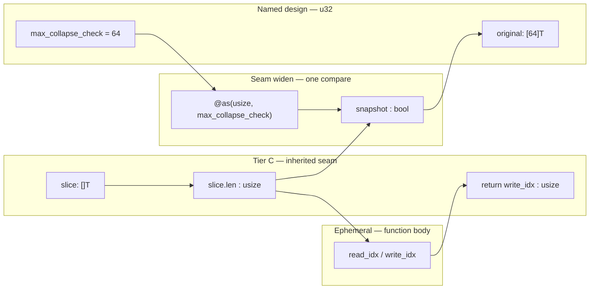

# 968 · `usize` Is a Boundary Type, Not a Design Type

*We audited strengthening passes for explicit widths and discovered we were measuring the wrong thing. Tiger Style and TAME agree on the policy; our first mechanical scanner did not. This note records what we learned and how the audit now works.*

**Language:** EN
**Version:** `20260621.050312` (Rye chronological stamp)
**Last updated:** 2026-06-21 (`050312` — safety walkthrough for allowed `usize`)
**Style:** Radiant (see `../context/RADIANT_STYLE.md`)
**Voice:** Reya 2
**Status:** Exploration — seam policy for **Zig-ground era**; strategic fork recorded in [`20260621-051312_literal-usize-ban-language-fork.md`](20260621-051312_literal-usize-ban-language-fork.md) · design silo [`../active-designing/yonder/20260621-051312_explicit-width-in-rye.md`](../active-designing/yonder/20260621-051312_explicit-width-in-rye.md)

> **Reorientation (`051312`):** Rye will fork to a **literal `usize` ban** in authored types. This document remains the accurate manual for strengthenings and audits **while** `rye/lib/std` is Zig-shaped and parity uses vendor baseline. New language work follows `970`.

---

## The Question

Phase 4 of the explicit-width program (`10024`, `992`) asks every strengthening pass to document where `usize` lives and where named `u32`/`u64` bounds replace it. The lexicon gates ✅ on that audit.

The first scanner (`043012` predecessor) listed **internal loop variables** like `var read_idx: usize` as compliant audit rows. That felt thorough. It was wrong.

---

## What Tiger Style Says

TigerBeetle's guide (`gratitude/TIGER_STYLE.md`, § Safety):

> Use explicitly-sized types like `u32` for everything, avoid architecture-specific `usize`.

The point is **exact behavior across targets** — especially when `usize` is 32 bits on one machine and 64 on another. Tiger does not ask us to eliminate every `usize` token in a function body; it asks us not to **design** with architecture width.

---

## What TAME Says — Same Policy

TAME voices the same rule for Rye (`TAME_STYLE.md`, `context/TAME_STYLE.md`):

| Width | Role |
|-------|------|
| **`u32`** | In-memory counts, indices, lengths **bounded by a named constant** |
| **`u64`** | Wire-persistent sizes, timestamps, offsets |
| **`usize`** | **Only** at the immediate Zig slice boundary — `buf.len`, `[]T` you do not own, inherited `std` APIs |

**Do not** publish `usize` in struct fields, parameters, or return types we author.

**`usize` is a boundary type, not a design type.** TAME does not soften Tiger here; it operationalizes the same discipline for Rye's inherited Zig `std` and our `.rye` witnesses.

---

## What We Were Measuring Wrong

The mechanical scanner treated these as audit wins:

```zig
var write_idx: usize = 1;
var read_idx: usize = 1;
```

Slice walks inside an inherited `pub fn` may use `usize` because Zig's slice model requires it. Those locals are **not** policy compliance — they are implementation detail at the seam. Listing them as `done` rows made passes look audited when we had only counted characters.

### What the audit must actually check

| Tier | Surface | Pass when |
|------|---------|-----------|
| **C — inherited `std`** | Public `usize` in Zig signature | Documented `done` — not a violation (`10024` rule 3: do not rename the public seam) |
| **Compliant** | `max_*: u32` | Named design bound, not `usize` |
| **Compliant** | `@as(usize, u32_bound)` | Seam **widen** for `.len` compare only |
| **Compliant** | `@intCast` + `assert` | Seam **narrow** per `10024` rule 2 |
| **`fail`** | `max_*: usize` | Tiger/TAME breach in code we touched |
| **`fail`** | `usize` in authored struct fields / public API | TAME breach in `.rye` we publish |
| **B — witness** | `rye/tests/*.rye` | `usize` only at `buf[0..n]` slice edge |

Internal loop indices are **out of scope** for the explicit audit table unless they appear in a published API.

---

## What “safe” means here

Tiger Style and TAME share one fear: **a width you chose without naming it**, so behavior silently changes when `usize` is 32 bits on `riscv64` and 64 bits on x86_64.

That fear bites in three places:

| Risk | Example | Why it hurts |
|------|---------|--------------|
| **Published contract** | `fn load(n: usize)` in our `.rye` | Callers on different targets pass different effective ranges; wire formats cannot pin a meaning. |
| **Stored state** | `struct { pos: usize }` we author | A value written on a 64-bit host may truncate or mis-compare when read on a 32-bit target. |
| **Silent narrow cast** | `const n: u32 = @intCast(huge_usize)` without `assert` | Truncation is a correctness bug Tiger expects us to crash on, not discover in production. |

Safety, for both styles, means: **every quantity that carries meaning across calls, modules, or targets has an explicit width you named** (`u32`, `u64`). `usize` may appear only where Zig’s slice machine already fixed the width at the door — and even then, **cross the seam with eyes open**: widen named bounds for compare, narrow with `assert`, never store the architecture width as your design.

The audit table records **design choices and seam crossings**. Ephemeral locals that never leave the function are permitted by the language; they are not what Tiger asks you to *document as compliance*.

---

## Five allowed patterns — how and why each is safe

### 1. Tier C — inherited `usize` in a public `std` signature

**Shape:** `pub fn f(slice: []T, …) usize` — unchanged Zig `std` API.

**How it works:** The caller owns the slice; `.len` is already `usize` in Zig’s type system. The return value means “length of result in elements,” same as upstream Zig.

**Why Tiger allows it:** Tiger says avoid `usize` in APIs **you publish**. This API is Zig’s, not ours. `10024` rule 3: do not rename the public seam — parity and every downstream caller depend on it.

**Why TAME allows it:** Tier C — inherited `std`. We strengthen *inside* the body (assertions, named `u32` bounds) without changing the contract at the door.

**What makes it safe across targets:** Semantic behavior matches Zig’s spec: lengths and indices follow the caller’s slice. We do not persist returned `usize` into our authored structs in this pass; we only return it to the same callers Zig already had. Cross-target variance in `usize` width is Zig’s inherited tradeoff at this boundary; our job is not to add *second* unnamed widths beside it.

**9913 instance:** `collapseRepeatsLen(…) usize` and `collapseRepeats(…) []T` stay Tier C — documented `done`, not a violation.

---

### 2. Named design bound — `max_*: u32` (not `usize`)

**Shape:**

```zig
const max_collapse_check: u32 = 64;
var original: [max_collapse_check]T = undefined;
```

**How it works:** The snapshot buffer size is a **compile-time-known design decision** — 64 elements — stored as `u32`.

**Why Tiger requires it:** “Use explicitly-sized types like `u32`” — the bound that *we* chose is not allowed to float with pointer width.

**Why TAME requires it:** “How many in this region” is `u32` with a named constant. The stack array `[max_collapse_check]T` ties memory to that exact width on every target.

**What makes it safe:** On both `riscv64` and x86_64, `max_collapse_check` is the integer 64 — not “whatever `usize` is today.” Postcondition walks that use `original` never read past 64 regardless of host width.

**If we used `max_collapse_check: usize` instead:** We would be designing with architecture width — audit **`fail`**. A constant “64” dressed in `usize` looks bounded yet invites mixing with `.len` arithmetic without an explicit seam story.

---

### 3. Seam widen — `@as(usize, u32_bound)` for compare with `.len`

**Shape:**

```zig
const snapshot = slice.len <= @as(usize, max_collapse_check);
```

**How it works:** The **decision** “is this slice at most 64 elements?” is made by comparing Zig’s `slice.len` (`usize`) to our named bound. We widen the `u32` to `usize` once, at the comparison, instead of narrowing `.len` without proof.

**Why Tiger allows it:** Tiger’s `u32` discipline lives in `max_collapse_check`. The widen is not a new design type — it is a **one-shot bridge** so the comparison type-checks at Zig’s slice edge.

**Why TAME allows it:** TAME’s table puts `usize` **only** at the immediate slice boundary. This line is exactly that: touch `.len`, widen the named bound to meet it, produce a `bool`.

**What makes it safe:**

1. **No information loss on widen:** `max_collapse_check` is 64; every `u32` value used here fits in `usize` on any target Zig supports.
2. **No stored result:** `snapshot` is `bool` — architecture width does not leak into state.
3. **Correct direction:** We widen a small known constant to meet `.len`, rather than `@intCast(slice.len)` to `u32` without an `assert` that `.len <= maxInt(u32)` (that would be seam **narrow** — pattern 4).

**Contrast — unsafe narrow:**

```zig
// FAIL without assert: slice might not fit in u32 on a 64-bit host
const len_u32: u32 = @intCast(slice.len);
```

---

### 4. Seam narrow — `@intCast` with `assert` before crossing inward

**Shape (authored Rye — `caravan/twin.rye`):**

```zig
fn bufLenU32(buf: []const u8) u32 {
    std.debug.assert(buf.len <= std.math.maxInt(u32));
    return @intCast(buf.len);
}
// … later, only when indexing the slice:
const start: usize = @intCast(self.pos);
std.debug.assert(start <= buf.len);
return buf[start .. start + @as(usize, @intCast(n))];
```

**How it works:** At the door, prove `buf.len` fits in `u32`, then **work in `u32`** (`pos`, `cap`, `n`). When Zig requires slice indexing, widen back to `usize` with `assert` tying `start` to `buf.len`.

**Why Tiger requires the assert:** Assertions downgrade correctness bugs to loud crashes. A bogus narrow cast is a programmer error; `assert` makes it fail fast (`TIGER_STYLE.md` § Safety).

**Why TAME requires it:** `10024` rule 2 — pair every `@intCast` between `usize` and `u32` with a bound check. Interior logic stays in named width; `usize` appears only for `buf.len` and subslice syntax.

**What makes it safe:** After `bufLenU32`, every in-module index and length arithmetic lives in `u32` with a named max (`Region` capacity). Each widen to `usize` is guarded by `assert(start <= buf.len)` so the index cannot outrun the slice. Cross-target behavior matches because **the authoritative bound is `u32`**, not `usize`.

**9913 analogue:** The strengthen pass does not need inward narrow of full `slice.len` because the snapshot path is gated by `snapshot` (bool from pattern 3) before copying into `[64]T`. Large slices still run the main loop; only the verify copy is skipped — postconditions on `read_idx` / `write_idx` still hold.

---

### 5. Ephemeral `usize` locals — permitted, not audit rows

**Shape (inside `collapseRepeatsLen`):**

```zig
var write_idx: usize = 1;
var read_idx: usize = 1;
while (read_idx < slice.len) : (read_idx += 1) {
    slice[write_idx] = slice[read_idx];
    write_idx += 1;
}
assert(read_idx == slice.len);
assert(write_idx <= slice.len);
```

**How it works:** Zig requires `usize` for subscripting `slice[i]`. Indices are **function-local**, born from `slice.len`, and killed before return except for the return value (which is Tier C).

**Why this is allowed (but not listed as “compliant” in the audit):**

| Check | Reason |
|-------|--------|
| Not published | Callers never see `write_idx`; it is not in our API. |
| Not stored | No struct field survives the call. |
| Bounded | Loop guard `read_idx < slice.len` + terminal asserts pair the walk (`TIGER_STYLE` paired assertions). |
| No cross-module arithmetic | We do not add `write_idx` to a `u64` wire offset or persist it — it indexes only this slice. |
| Same semantics on every target | Indices stay in `[0, slice.len]`; Zig defines slice indexing identically; we do not assume `usize` is 32 or 64 bits in our design. |

**Why the audit skips them:** Listing `write_idx` as a policy “win” confuses **language-required locals** with **design choices** (`max_collapse_check: u32`). Tiger cares that you named your bounds and asserted your invariants — not that you re-typed every loop counter to `u32` inside a function that already speaks `[]T`.

**When ephemeral `usize` would become unsafe:** If we stored `write_idx` in a struct, returned it from our API, or mixed it into wire layout without `u32` + assert — that crosses from ephemeral to **design**, and TAME says no.

---

### 6. Return subslice — `slice[0..collapsed_len]` after assert

**Shape:**

```zig
const collapsed_len = collapseRepeatsLen(T, slice, elem);
assert(collapsed_len <= slice.len);
return slice[0..collapsed_len];
```

**How it works:** `collapsed_len` is `usize` because `collapseRepeatsLen` returns `usize` (Tier C). Before slicing, we assert the length fits inside the caller’s buffer.

**Why Tiger allows it:** Paired assertion immediately before the operation that depends on the property. Violation crashes — fail-fast.

**Why TAME allows it:** The seam is inherited: `[]T`’s length field is `usize` in Zig. We do not rename `collapseRepeats` to return a custom fat pointer.

**What makes it safe:** `assert(collapsed_len <= slice.len)` is the contract check. Without it, a bug in `collapseRepeatsLen` could construct an invalid subslice; with it, Tiger’s assertion discipline catches the error at the callsite door.

---

## Walkthrough: `9913` end-to-end



| Line / region | Width | Role | Safety mechanism |
|---------------|-------|------|------------------|
| `slice: []T` | `usize` at edge | Caller’s buffer | Tier C — unchanged API |
| `max_collapse_check: u32 = 64` | `u32` | Our snapshot budget | Named bound; exact on all targets |
| `slice.len <= @as(usize, …)` | widen at seam | Gate snapshot | `bool` only; no stored `usize` design |
| `while (read_idx < slice.len)` | ephemeral `usize` | Walk caller slice | Bounded by `.len`; paired asserts after |
| `assert(read_idx == slice.len)` | — | Postcondition | Tiger paired check — consumed all input |
| `assert(write_idx <= slice.len)` | — | Postcondition | Result fits in place |
| Snapshot verify loop | ephemeral `usize` | Cross-check ≤64 elems | Only runs when `snapshot` true |
| `return write_idx` | `usize` | Tier C return | Same as Zig `std`; callers already expect it |
| `collapseRepeats` + `assert` + `slice[0..n]` | seam | Subslice return | Assert before trusting length |

**Cross-target story in one sentence:** The only architecture-sized quantity that enters our *design* is the caller’s `slice.len`; we never store it — we optionally compare it to a **`u32` constant** at the seam, walk with language indices under **assertions**, and return a length through the **inherited** `usize` return type.

---

## What fails the audit — and why

| Pattern | Verdict | Safety reason |
|---------|---------|---------------|
| `max_foo: usize = 64` | **fail** | Named bound must be `u32` — “64” is a design choice, not pointer width |
| `@intCast(slice.len)` → `u32` without `assert` | **fail** | Silent truncation on large slices |
| `pos: usize` in our `.rye` struct | **fail** | Stored state would vary in meaning across targets |
| `pub fn witness(n: usize)` we publish | **fail** | Public contract owns architecture width |

---

## Example: Pass 9913 (summary)

`collapseRepeatsLen` keeps public `usize` (Tier C), names `max_collapse_check: u32 = 64`, and widens at the seam:

```zig
const snapshot = slice.len <= @as(usize, max_collapse_check);
```

The audit rows document Tier C, the `u32` bound, and the seam widen — not `write_idx` / `read_idx`.

---

## Tooling — TAME Rye, Not Python

The audit logic lives in **`tools/tame_usize_audit.rye`**. The strengthening enricher is **`tools/enrich_strengthening_docs.rye`** with modules under `tools/enrich/`. Run:

```bash
rye run tools/enrich_strengthening_docs.rye
```

Our gate trio (`parity.rish`, `additive-gate.rish`) already runs in Rishi; the doc-generation pipeline now matches — authored in the family, garden-allocated, explicit widths in the tooling itself.

---

## What This Opens

- **Lexicon ✅** means Tiger/TAME policy passes on live `pub fn` bodies — zero `fail` rows.
- **Phase 1–3 width migration** in authored `.rye` follows the same table; witnesses stay Tier B.
- **Future auditors** (Rishi wrappers, CI) can call the Rye modules rather than re-interpret policy in another language.

---

*May every width we name be a width we chose. May `usize` stay at the door — the seam where Zig meets the slice — and may every crossing inward carry an assert that proves the narrow is true.*
