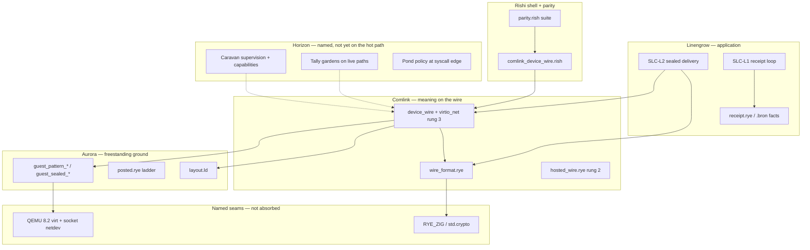

# Device Wire Dependencies — From SLC-L2 Down to Caravan and Tally

*Kaeden asked what we depend on, all the way down, for the work we hold now — Comlink device wire landed, parity **154** at the gate, **SLC-L2** sealed delivery next on the Linengrow ladder. This survey names every layer from the civic receipt down through supervision and bounded memory, states what is **landed** versus **horizon**, and cites the outside sources we study without importing their vocabulary into our modules.*

**Stamp:** `20260705.235412` · **Last updated:** 2026-07-05
**Language:** EN
**Style:** Radiant (see `../context/RADIANT_STYLE.md`) · **Lens:** TAME · SLC · TWO_ROOMS
**Category:** External research — dependency survey; proposes no new module names
**Status:** Research for understanding — dependency survey; checkable claims cite witnesses on metal; seats nothing by itself
**Ground:** [`20260704-211012_rye-cores-and-the-gratitude-lineage.md`](20260704-211012_rye-cores-and-the-gratitude-lineage.md) · [`20260704-024900_claim.md`](20260704-024900_claim.md) · yonder [`../active-designing/yonder/20260620-041412_virtio-the-device-wire.md`](../active-designing/yonder/20260620-041412_virtio-the-device-wire.md) · [`../active-designing/yonder/20260620-042812_tally-and-who.md`](../active-designing/yonder/20260620-042812_tally-and-who.md)

*Written in Rio 3's Radiant voice, for Kaeden and every future sitter.*

---

## Part One — What We Are Working On Now

The **Linengrow-via-Comlink** season (`20260705.203144`) climbed the Rye spine step that unlocks civic sealed delivery:

| Milestone | Status | Artifact |
|-----------|--------|----------|
| **SLC-L1** — sign, append, fold, verify a receipt on one machine | **Landed** · parity **152** | `linengrow/receipt.rye`, `tools/slcl1_receipt.rish` |
| **Comlink device wire** — same sealed datagram across virtio-net between two guests | **Landed** · witness GREEN | `comlink/virtio_net.rye`, guests, `run_device_wire_lab.sh` |
| **Parity 154** — device wire witness wired into `parity.rish` | **This pass** | `tools/comlink_device_wire.rish` |
| **SLC-L2** — signed receipt **identity to identity** under seal | **Next lap** | Needs Comlink carriage + Linengrow receipt shape |

**SLC-L2** is not “more virtio.” It is **SLC-L1’s receipt loop** riding **Comlink’s wire** so Bob’s garden opens what Alice sealed — the eight-asks ordering still holds: vocabulary and Open Asks remain parallel design threads; the **carriage** for L2 is now proven.

---

## Part Two — The Stack (Top to Bottom)

**Reading the diagram:** solid arrows are **landed dependencies** today; dashed lines are **design contracts** the device wire already honors in miniature (`WireSubject`, fixed RAM pages, `queue_depth`) without yet calling `caravan/` or `tally/` modules from freestanding guests.

---

## Part Three — Layer by Layer

### 3.1 Linengrow — the “why” and the receipt shape

| Dependency | Role | Landed? |
|------------|------|---------|
| `linengrow/receipt.rye` | Ed25519 sign · append log line · fold balance · verify | Yes — SLC-L1 |
| `tools/fixtures/slcl1_fact.bron` | Golden fact for witness | Yes |
| SLC-L2 scope | One receipt, two identities, sealed on the wire | **Horizon** — carriage ready |

SLC-L2 **depends on** Comlink carrying bytes unchanged; it **does not depend on** virtio specifically once hosted UDP or a future Pond socket could substitute — the **datagram letter** is the invariant ([`wire_format.rye`](../comlink/wire_format.rye)).

### 3.2 Comlink — the letter and the carriage

| File | Rung | Depends on |
|------|------|------------|
| `wire_format.rye` | Format law | `std.crypto` (Ed25519, X25519, ChaCha20-Poly1305, SHA3-512) via Rye |
| `hosted_wire.rye` | Localhost UDP | `wire_format`, libc sockets (host seam) |
| `device_wire.rye` | Hosted algebra | `wire_format`, `virtio_net` types |
| `virtio_net.rye` | Freestanding driver | Aurora `layout.ld`, MMIO, fixed guest RAM map |
| `guest_sealed_*.rye` | Sub-lap 3 proof | `virtio_net` + `wire_format` (no format fork) |

**Horizon:** Comlink v1 (typed delivery, exactly-once by content-name) — [`yonder/20260620-041412_virtio-the-device-wire.md`](../active-designing/yonder/20260620-041412_virtio-the-device-wire.md) rung 4.

### 3.3 Aurora — boot and the wire ladder

| Dependency | Role | Landed? |
|------------|------|---------|
| `aurora/layout.ld` | `_start` at `0x80000000`; discard `.eh_frame`; fold `.sdata`/`.sbss` | Yes — shared by all freestanding stages |
| `aurora/src/posted.rye` | Two-hart sealed datagram over shared memory | Yes — rung 1 proof |
| `aurora/run.sh` | Build + QEMU `virt` wake pattern | Yes — lab inherits flags |

Device wire guests **do not** call Aurora modules at runtime; they **inherit** the same linker contract and QEMU machine model.

### 3.4 Rye toolchain and Rishi shell

| Dependency | Role |
|------------|------|
| `rye/bin/rye build` | Freestanding `riscv64` and hosted `-lc` binaries |
| `vendor/zig-toolchain/zig` | `RYE_ZIG` — crypto, freestanding lib |
| `rishi/bin/rishi run` | Witness orchestration |
| `tools/parity.rish` | Regression suite — each block is one claim ([`20260704-024900_claim.md`](20260704-024900_claim.md)) |

**Core + shell:** virtio driver and seal/open live in `.rye`; the lab and parity entry live in `.rish` — [`active-designing/20260704-211012_the-rye-core-and-the-shell.md`](../active-designing/20260704-211012_the-rye-core-and-the-shell.md).

### 3.5 Host seams (named, not absorbed)

| Seam | What we lean on | Discipline |
|------|-----------------|------------|
| **QEMU 8.2** | `virt` machine, `virtio-net-device`, socket netdev, `force-legacy=false` | Emulator-first lab; metal hypervisor is horizon |
| **OASIS virtio 1.2 §4.2** | MMIO register map, split queues | Studied; driver is ours ([`20260705-233012_virtio-tx-ruling.md`](../active-designing/20260705-233012_virtio-tx-ruling.md)) |
| **libc / UDP** | `hosted_wire` only | Hosted rung; not in freestanding guests |

### 3.6 Caravan — supervision and capabilities (horizon on the hot path)

**Today:** device wire lab runs **two bare QEMU processes** — no Caravan stage supervises them. **Design contract** for the next widening:

| Caravan artifact | What it proves | How device wire prepares |
|------------------|----------------|---------------------------|
| `caravan/seed.rye` | Readiness line | Same “speak then rest” habit as guests |
| `caravan/bounded.rye` | Restart on fall | Future: supervised Comlink process |
| `caravan/chain.rye` | Ordered startup | TX guest before RX listen + connect skew |
| `caravan/capabilities.rye` | `right_net`, `right_device` on named resources | **`tools/caravan_capabilities.rish`** in parity — policy table hosted |

**SLC-L2 horizon:** a **Caravan-supervised** Comlink peer holds the virtio queue handles; capabilities declare which child may touch `virtio-net` ([`caravan/capabilities.rye`](../caravan/capabilities.rye) — `right_net` / `right_device`). The device wire lap proves the **peer can speak** before supervision wraps it.

### 3.7 Tally — bounded gardens (discipline landed, module optional on guest)

**Today:** freestanding guests use **compile-time constants** and fixed addresses — `queue_depth = 4`, `max_frame = 256`, `wire_capacity = 512` — the same *habit* as Tally without calling `tally/gardens.rye` on bare metal.

| Tally concept | Device wire expression | Future module hook |
|---------------|------------------------|-------------------|
| Named garden | `WireSubject`, `rx_rings` / `tx_rings` pages | `Gardens.get("virtio_rx")` on hosted peer |
| Stated edge | `validateChain` → `OutOfBounds` | Router queue depth in Comlink v1 |
| Season clear | `clearRings` between laps | Opener clears opened buffer after handler |

[`yonder/20260620-042812_tally-and-who.md`](../active-designing/yonder/20260620-042812_tally-and-who.md): **shape-cast** is Comlink; **container bounds** are Tally. Sub-lap 3 does both — `openDatagram` refuses bad crypto; frame length refuses overrun.

**Parity today:** `tally/gardens.rye` selftest runs inside the rye witness block list; `tools/foundation_seeds.rish` covers Tally + Brushstroke seeds — **orthogonal** to device wire witness, same suite.

---

## Part Four — Dependency Table (What Blocks What)

| If this fails… | …this breaks | Mitigation landed |
|----------------|--------------|-------------------|
| `layout.ld` reset address | All freestanding guests (opt-sensitive) | `.eh_frame` discard + `.text.init` first |
| `wire_format` fork | SLC-L2, hosted wire, device wire | Single module, imported everywhere |
| `virtio_net` TX/RX | Sub-laps 2–3 | Ruling + lab script + witness |
| `hosted_wire` | Parity Comlink hosted block | Independent rung — still green |
| `caravan/capabilities` | Nothing on device wire hot path | Hosted policy only |
| `tally/gardens` | Mantra/Brushstroke paths | Not on virtio guest path |

---

## Part Five — SLC-L2: Composed Dependencies

**SLC-L2** = **SLC-L1 receipt semantics** ⊗ **Comlink sealed datagram** ⊗ **delivery path** (hosted UDP first for iteration; device wire for the civic story).

Minimum composed stack:

1. `linengrow/receipt.rye` — sign the fact (already landed).
2. `wire_format.sealDatagram` — same bytes as hosted/device wire (landed).
3. Transport — `hosted_wire` **or** `guest_sealed_*` lab (landed).
4. Opener — Bob's secret + `openDatagram` (landed on RX guest).
5. **Horizon:** identity binding (unified keys `994`), Caravan-spawned peers, Pond `right_net`.

**Not required for first SLC-L2 bench:** Brix peer declarations, Mantra persistence, resin-batch frame (I1), Edit-5 snapshot export (I2).

---

## Part Six — With Gratitude

| Source | License | What we studied | What we built |
|--------|---------|-----------------|---------------|
| **OASIS virtio 1.2** | Specification | MMIO map, split queues, init order | `virtio_net.rye` |
| **QEMU** | GPL-2.0 | `virt` machine, trace, `force-legacy` | Lab script only — not linked |
| **xv6-riscv** (teaching forks) | MIT-style | Split-queue illustration | Clean-room driver |
| **Linux `virtio_mmio.c`** | GPL-2.0 | Register offset confirmation | Concepts only in ruling |
| **skarnet / s6** | ISC | Supervision discipline | Caravan chain pattern |
| **TigerBeetle / resin research** | Study | Control-before-data | `wire_format` habits — not I1 batch frame |

Full license table: [`20260620-014412_system.md`](20260620-014412_system.md) → Gratitude Licenses and the Clean Room.

---

## Part Seven — Companion in Active-Designing

Implementation law and sub-lap status: [`../active-designing/20260705-225412_comlink-device-wire.md`](../active-designing/20260705-225412_comlink-device-wire.md).

Counsel questions answered: [`../active-designing/20260705-233012_virtio-tx-ruling.md`](../active-designing/20260705-233012_virtio-tx-ruling.md).

---

*May every dependency stay named. May Caravan and Tally meet the wire as supervision and garden, not as silent heap. And may SLC-L2 climb from ground that already holds.*
