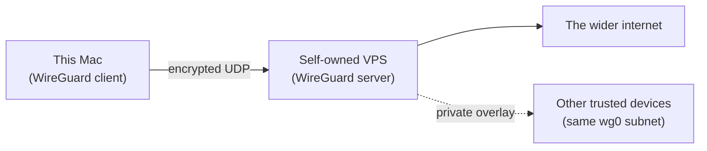

# A Self-Hosted VPN for a Work Laptop Holding Real Credentials

**Language:** EN
**Version:** `20260713.212900`
**Style:** Radiant (see `../context/RADIANT_STYLE.md`)
**Status:** Vision register — living recommendation, not yet implemented

---

## The Frame

Kaeden asked this as if standing in as CTO of a company (named as Acme Corporation, for shape only, in acknowledgment of Tlon Corporation — this document makes no claim about either company's actual security posture and is not written on behalf of either) responsible for the SSH keys, GPG signing key, and forge tokens that now live on this Mac. Treated as a work machine rather than a personal one, the question is: **should this laptop route through a self-hosted VPN, and if so, which one, set up how?**

**Short answer: yes, and WireGuard is the right primitive.** Commercial VPN providers are the wrong shape for this threat model — they are built to hide *your* traffic from *your ISP*, not to give a company control over *its own* network egress and audit trail. A company protecting credentials wants a VPN it owns end to end: the server, the keys, the logs (or deliberate absence of logs), and the exit IP.

---

## Why Self-Hosted, and Why WireGuard Specifically

- **No third party sees the traffic's metadata, because there is no third party.** A commercial VPN is itself a man-in-the-middle you have chosen to trust; a self-hosted one removes that trust requirement entirely — the only party who can see decrypted traffic is Kaeden's own infrastructure.
- **WireGuard is small enough to audit.** Its entire cryptographic core is a few thousand lines, built on modern, fixed primitives (Curve25519, ChaCha20, Poly1305, BLAKE2s) with no negotiated cipher suites to misconfigure — a sharp contrast to OpenVPN's much larger, more configurable, and historically more bug-prone codebase. For a CTO answerable for what got approved, a smaller trusted-computing base is a real advantage, not just a performance one.
- **It is already in the Linux kernel and available everywhere that matters** — a Homebrew-installable client on this Mac, a `wireguard-tools` package on any Linux VPS, official apps for the other platforms a team is likely to carry.
- **Key-based identity, not passwords.** Every peer is a Curve25519 keypair; there is no password to phish, guess, or leak in a breach dump — the same reasoning this project already applies to SSH and GPG.

---

## The Architecture



- **The server**: a small VPS (1 vCPU, 1 GB RAM is plenty for WireGuard itself) from a provider Kaeden controls billing and root access for — Hetzner, DigitalOcean, Vultr, or self-owned hardware on a static IP all work; the requirement is *root access and full disk control*, not a specific brand.
- **The client**: this Mac, running the official WireGuard macOS app (Mac App Store) or the CLI (`brew install wireguard-tools`) — either drives the same underlying kernel-adjacent tunnel.
- **The traffic decision — split-tunnel vs. full-tunnel:** for credential protection specifically (not general privacy), a **split tunnel** that routes only traffic to company infrastructure (the forges, internal services, a company DNS resolver) through the VPN, while ordinary web browsing goes direct, is usually the right balance — it keeps the sensitive lanes on a controlled path without making every coffee-shop Zoom call hairpin through one VPS. A **full tunnel** (all traffic through the VPN) is the stronger but heavier choice for higher-risk travel (public conferences, untrusted networks) — worth keeping as a second WireGuard profile to switch to, rather than the default.

---

## Setup, Step by Step

### 1. Provision the server

Any recent Debian or Ubuntu LTS is fine. As root, on first boot:

```bash
apt update && apt upgrade -y
apt install -y wireguard ufw fail2ban unattended-upgrades
dpkg-reconfigure --priority=low unattended-upgrades   # security patches land automatically
```

**Harden SSH before anything else touches this box:**

```bash
# In /etc/ssh/sshd_config:
PasswordAuthentication no
PermitRootLogin prohibit-password
# Then, with your own SSH public key already in ~/.ssh/authorized_keys:
systemctl restart sshd
```

### 2. Generate the server keypair

```bash
cd /etc/wireguard
umask 077
wg genkey | tee server_private.key | wg pubkey > server_public.key
```

The private key **never leaves this VPS**. Treat it with the same discipline this project already gives SSH and GPG private keys.

### 3. Write the server config (`/etc/wireguard/wg0.conf`)

```ini
[Interface]
Address = 10.66.0.1/24
ListenPort = 51820
PrivateKey = <contents of server_private.key>
PostUp   = iptables -A FORWARD -i wg0 -j ACCEPT; iptables -t nat -A POSTROUTING -o eth0 -j MASQUERADE
PostDown = iptables -D FORWARD -i wg0 -j ACCEPT; iptables -t nat -D POSTROUTING -o eth0 -j MASQUERADE

# One [Peer] block per device that connects — add this Mac first
[Peer]
PublicKey = <this Mac's public key, from step 4>
AllowedIPs = 10.66.0.2/32
```

```bash
sysctl -w net.ipv4.ip_forward=1                       # persist in /etc/sysctl.conf too
ufw allow 51820/udp
ufw allow OpenSSH
ufw enable
systemctl enable --now wg-quick@wg0
```

### 4. Generate this Mac's keypair and client config

```bash
brew install wireguard-tools
wg genkey | tee ~/.wireguard/laptop_private.key | wg pubkey > ~/.wireguard/laptop_public.key
```

Client config (imported into the WireGuard macOS app, or run via `wg-quick`):

```ini
[Interface]
PrivateKey = <laptop_private.key contents>
Address = 10.66.0.2/32
DNS = 10.66.0.1                                        # a self-hosted resolver on the VPS avoids DNS leaks

[Peer]
PublicKey = <server_public.key contents>
Endpoint = <VPS public IP>:51820
AllowedIPs = 10.0.0.0/8, 172.16.0.0/12                  # split-tunnel: only company/internal ranges
# AllowedIPs = 0.0.0.0/0                                # swap to this line for the full-tunnel profile
PersistentKeepalive = 25
```

Paste the Mac's public key back into the server's `[Peer]` block from step 3, restart `wg-quick@wg0` on the server, and bring the tunnel up on the Mac.

### 5. Prove it works, then harden further

- `wg show` on both ends confirms a live handshake and recent data transfer.
- From the Mac, confirm a request to an internal-only resource succeeds through the tunnel and fails without it.
- Add `fail2ban` jails for `sshd` on the VPS (already installed in step 1) so brute-force SSH attempts get banned automatically.
- Rotate every keypair on a calendar (quarterly is a reasonable default for a company posture) — WireGuard's keys are cheap to regenerate and this project's own "accrete, never break" instinct applies just as well to key hygiene: retire the old peer entry only after the new one is confirmed live.
- If the team grows past a handful of devices, look at **Headscale** — a self-hosted, open-source, Tailscale-compatible coordination server that manages WireGuard peer configuration and ACLs automatically, so new laptops join a mesh instead of every device needing a hand-edited `[Peer]` block. It stays fully self-hosted (no dependency on Tailscale's own coordination servers) while keeping the day-to-day experience of the official Tailscale client apps, which is the practical reason teams reach for it over raw `wg-quick` once past three or four peers.

---

## What This Buys, Concretely, for the Credentials Already on This Machine

- Pushes and forge API calls can be pinned to route only through the company-controlled tunnel, so a network-level observer on an untrusted Wi-Fi network never sees which forges or endpoints this laptop talks to.
- A future internal service (a private package registry, an internal `gh`-mirror, a company DNS resolver naming internal hosts) has a real network boundary to sit behind, rather than being exposed to the open internet or reachable only by IP allow-listing.
- None of this replaces FileVault, the SSH/GPG key hygiene already in place, or `gh`'s own token scoping — a VPN protects traffic in flight, not a key sitting on disk. It is one more independent layer, not a substitute for the ones already named in [`context/specs/20260713-211800_local-host-system-hardware-anonymized.md`](../context/specs/20260713-211800_local-host-system-hardware-anonymized.md).

---

*May the tunnel hold what it should, and may every peer allowed through it earn that trust plainly, one named key at a time.*
