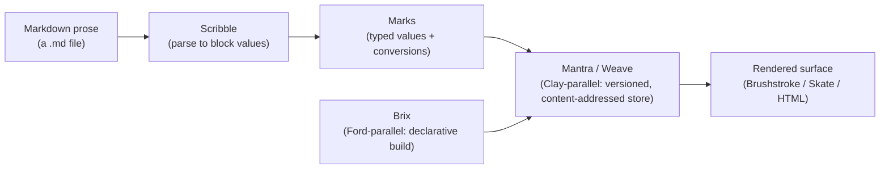

# Fusing the Doc Pipeline — Scribble, Brix, and Mantra in Glow

**Language:** EN
**Version:** `20260713.235700` (Pacific)
**Style:** Radiant (see `../context/RADIANT_STYLE.md`)
**Status:** Design research — no code written, no module renamed; proposes roles for Keaton to confirm

---

## For an Acme Corporation Employee Reading This

This document designs how Glow OS's own documentation pipeline fuses three existing Glow OS modules with the corresponding parts of Urbit's Hoon/Clay/Ford machinery — in Glow, under the proposed vane-parallel names, governed by TAME. It is a design proposal, not an implementation. Where it proposes a module role, that role is added to the names-awaiting-confirmation checklist ([`../context/specs/20260713-235600_names-awaiting-confirmation.md`](../context/specs/20260713-235600_names-awaiting-confirmation.md)).

## The Three Fusions, in One Picture

Read left to right: prose becomes block values (Scribble), those values carry a typed *mark* with conversion gates (the Clay idea), they are stored and versioned in Mantra/Weave (the Clay-parallel), Brix declares how the pieces build (the Ford role), and the result renders to a surface.

## Fusion 1 — Scribble × Hoon's Markdown Marks

**What each side already is.** Scribble already turns markdown into Bron block values — headings, paragraphs, fenced code with `rye_fence`/`rish_fence`/plain kinds ([`../scribble/README.md`](../scribble/README.md)). Urbit handles markdown through a **mark**: `%md` is a named type with **conversion gates** (for example `%md` to `%html`), and Clay runs those conversions when a file crosses a boundary that needs a different shape.

**The fusion.** Scribble becomes Glow OS's **markdown mark**: not only a parser, but a typed value with declared, TAME-bounded conversions — `scribble` (blocks) to `html`, to `skate` (the drawn-terminal frame Scribble views already produce), to `plain`. In Glow terms this is exactly the aura/mark discipline the Glow supplement already proposes: a value is not just "some blocks," it is "blocks of mark `scribble`, with these named conversions and their bounds." Every conversion is a gate with a paired witness proving `scribble → html → scribble` round-trips (the dual-description witness pattern from the grain-lineage silo). Scribble keeps its name; it gains the mark role.

## Fusion 2 — Brix × Ford

**What each side already is.** Brix is the declarative composition language: a `.brix` descriptor says *what a system is made of* — one field per line, no logic (per TAME's Brix supplement). Ford was Urbit's build system: it resolved dependencies and compiled Hoon, and in modern Arvo it folded into Clay.

**The fusion.** Brix takes Ford's *role* without taking Ford's complexity: a `.brix` descriptor names the pieces, and a small resolver (living with the Clay-parallel, Mantra) turns that declaration into a built artifact by resolving each named piece to its content-addressed value and running its mark conversions. This keeps Brix purely declarative (no loops, no expressions — TAME's Brix rule holds) while giving it Ford's job. Brix is the **Ford-parallel** the naming-mapping proposal already tentatively named; this confirms that role and says how it works: **Brix declares, Mantra resolves, marks convert.**

## Fusion 3 — Mantra / Weave × Clay (the deepest one)

**What each side already is.** Mantra is the versioned weave — a content-addressed, append-only log with a referential namespace ([`../mantra/README.md`](../mantra/README.md)); the naming-mapping proposal already names it the **Clay-parallel**. Clay is Urbit's revision-controlled filesystem: typed by marks, organized into desks, every commit a content-addressed snapshot, with mark-conversions at its boundaries.

**The fusion.** Mantra grows the parts of Clay it does not yet have, staying within its own fold model:

- **Marks as first-class.** Every value in the weave carries a mark (its type + conversions), so Mantra can convert at boundaries the way Clay does — this is where Fusion 1's Scribble mark and Fusion 2's Brix build both plug in.
- **Desks as namespaces.** Clay's "desk" (a versioned, independently-updatable subtree) maps onto a Mantra namespace — useful directly for the Glow OS docs scaffold, where each of the four OS variants (Reya/Riyo/Trey/Triz) is a desk-like namespace over one shared doc template.
- **Commits stay folds.** Mantra does not adopt Clay's implementation; it keeps state as a pure fold over signed facts (the spine the ROADMAP already names) and simply adds the mark and desk *concepts* on top. This is Gall's-Law: grow Clay's proven ideas from the simpler weave that already works, rather than porting Clay's C.

## What This Gives Glow OS, Plainly

- **One documentation pipeline** from prose to rendered surface, every stage a TAME-bounded value with a mark — which is exactly what the Glow OS docs scaffold (this turn) needs to eventually be *built*, not just written by hand.
- **Confirmation and mechanism** for three vane-parallel roles the naming-mapping proposal had only sketched: Scribble as the markdown mark, Brix as the Ford-parallel build declarer, Mantra as the Clay-parallel store-with-marks.
- **A concrete first witness target** for a future pass: `scribble → html → scribble` round-trip, proving the mark-conversion seam before any of it is wired into Mantra.

## What Stays Open (for the names spec and Keaton's word)

- Whether Scribble/Brix/Mantra keep their names in a vane *role* or take literal Urbit vane names — the standing question in the names spec.
- Whether the mark system earns its own module name or lives inside Mantra.
- No code: this is the design; the first witness (the round-trip above) is the future implementation step, gated on Keaton's word.

## Galaxy Pitch

For: galaxy holders interested in a Clay/Ford-lineage document and build pipeline grown the SLC way.
Ask: none; design research.
Scope: reading now; the round-trip witness would be a small, single-seam future PR.
