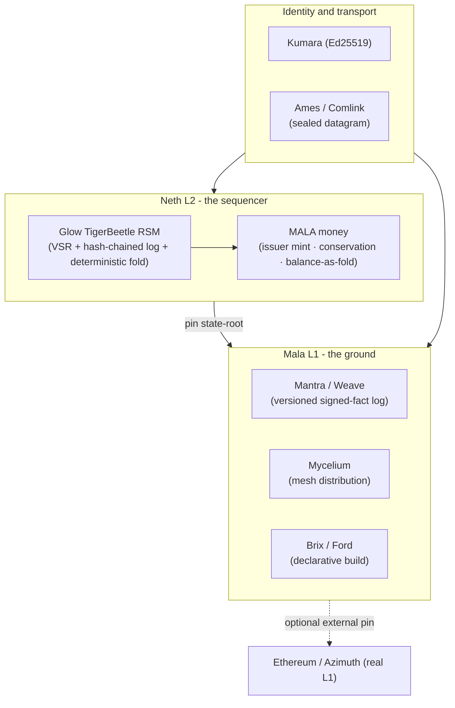

# Neth, Mala, and a Settlement Layer for Glow OS — Design

**Language:** EN
**Version:** `20260714.001017` (Pacific)
**Style:** Radiant (see `../context/RADIANT_STYLE.md`)
**Status:** Vision register — design and social-experiment research only. **Not financial, investment, or legal advice.** Nothing here is a deployed system, a token, a securities offering, or a call to move real money. It is an architecture proposal for Keaton to confirm or deny, grounded in what already runs in this tree.

---

## For an Acme Corporation Employee Reading This

Keaton proposed a new settlement layer for Glow OS: an **N-vane called Neth** (after Maze's M), a Glow reimplementation of Sui's/TigerBeetle's shape, evolved from the existing MALA money work, interoperating with Ethereum, with a TigerBeetle-style L2 "pinned sidechain" over a Mala L1 woven from Mycelium/Weave/Mantra/Ford and secured by a Kumara+Ames fusion. This document untangles that into its load-bearing engineering core (which is strong and continuous with work already in the tree), separates the visionary "fractal universe of four chains" framing (which is the social-experiment register, kept distinct), flags a real naming collision, and recommends a minimal first lap.

## The Load-Bearing Core (grounded, and already half-built here)

The strongest thing about this proposal is that its technical spine is **not new** — it is the natural next step of three things already in this tree:

- **MALA** is already issuer-only mint + conservation-enforced transfer + **balance as a fold over a signed log** ([`../linengrow/mala.rye`](../linengrow/mala.rye), MALA M1/M2, parity 198–199). That is L1 money semantics.
- **WOV** is already the settlement/exit-honesty layer (exit honesty, dual-monarch, parity 201–205) — **and it already had a TigerBeetle pin seam**, retired `20260711.055800` but explicitly kept "revivable later if MALA log-and-fold ever needs TB throughput" ([TASKS.md](../work-in-progress/TASKS.md); counsel [`055112`](../counsel/20260711-055112_claude-counsel-wov-tigerbeetle-recommendation.md)). Neth is, in plain terms, **the revival and full flowering of that retired WOV-TB pin.**
- **TigerBeetle is a Replicated State Machine** — Viewstamped Replication over an immutable, hash-chained, append-only log of prepares, executed deterministically (confirmed from TigerBeetle's own ARCHITECTURE.md and the trillion-transactions post). This is *architecturally almost identical to an L2 sequencer*: a deterministic state transition over an ordered log, with the log as ground truth and periodic checkpoints. TigerBeetle's own shape is the correct substrate for a settlement L2 — this is why "a Glow reimplementation of TigerBeetle as a pinned sidechain" is a genuinely coherent idea, not a buzzword pile.

So the core, stated once and plainly:

> **Neth is a deterministic replicated state machine (TigerBeetle's shape, reimplemented in Glow under TAME) that sequences MALA money transfers into a hash-chained log, folds them into balances, and periodically pins its state-root to an L1 — exactly as an L2 rollup posts roots to Ethereum.**

Everything else in the proposal is either (a) which L1 it pins to, or (b) the visionary framing around it.

## The Layers, Named Cleanly

- **Neth (L2 sequencer):** the Glow-TigerBeetle RSM sequencing MALA transfers. Fast, deterministic, bounded (TAME), single-threaded in the TigerBeetle tradition.
- **Mala L1 (the ground):** Mantra/Weave as the versioned signed-fact log, Mycelium for mesh distribution, Brix/Ford for declarative build. Neth pins its roots here.
- **Identity + transport:** Kumara (Ed25519) signs every fact; Ames/Comlink (the sealed datagram, already the Ames-parallel per the naming-mapping) carries them. The "Kumara+Ames fusion" Keaton names is exactly this seam — signed identity plus sealed transport, which Comlink + Kumara already provide together.
- **External pin (optional, later):** the Mala L1 root can itself be pinned to a real external L1. **Azimuth is the natural first choice** — it is already Urbit's own Ethereum PKI (galaxies/stars/planets as NFTs on contracts Keaton already holds points on), so pinning to Azimuth/Ethereum is the most coherent, least-invented external anchor.

## The Visionary Register, Kept Separate (per silo discipline)

The "**social experiment implementing a new fractal universe of ETH/SOL/SUI/Azimuth as Mala**" is the vision layer, and it belongs in its own register — the same way the grain-lineage silo separates load-bearing engineering from devotional/aether framing. Held honestly:

- The "fractal universe" framing ties to the Gardi fractal material already siloed ([`grain-lineage-silo/whole-in-every-part.md`](grain-lineage-silo/whole-in-every-part.md)) — self-similar structure across scales. As *inspiration* for why a small settlement layer can mirror the shape of the big chains, it is lovely. As an *engineering claim*, it is not load-bearing and should not gate the technical work.
- Bridging four external chains (ETH/SOL/SUI/Azimuth) at once is the maximal version. **My honest recommendation: do not build toward four bridges.** Pick one anchor — Azimuth/Ethereum — because it is already this fork's own PKI and needs no new trust assumptions. SOL/SUI interop is a horizon, not a first lap. This is Gall's Law and the project's own IronBeetle sobriety anchor ("beat one honest thread before scaling counts").

## The Naming Question — Neth, Honestly

**The good:** N follows Maze's M; "Neth" is four letters, fitting the vane convention. There is a genuinely beautiful resonance — **Neith**, the ancient Egyptian goddess of *weaving* and creation, which rhymes with the Weave at Mala's heart.

**The real collision:** "Neth" is live Nethermind-ecosystem shorthand — Nethermind is a top-two Ethereum execution client, its dev mode is `spaceneth`, its plugins use the `neth`/`NethDev` prefix. An Ethereum-*interoperating* settlement layer named **Neth** is maximally confusable with Nethermind, precisely because they occupy the same Ethereum-infrastructure space. This is a stronger collision than Glow's was, because the domains overlap exactly.

**My recommendation:** weigh this as a real fork, do not just adopt Neth by default. Three honest paths:
1. **Keep Neth**, accept the collision, lean on context to disambiguate. Simplest; risks confusion in exactly the ecosystem Neth talks to.
2. **Use "Neith"** (the weaver goddess) — claims a beautiful, distinct meaning and sidesteps the Nethermind shorthand, at the cost of breaking the strict four-letter vane rule (Neith is five).
3. **Pick a different four-letter N-name** with no Ethereum collision. I will not invent one under pressure; if Keaton wants this path, it earns its own naming-proposal pass (the `_naming-proposal.prompt.md` component exists for exactly this).

I lean toward **2 or 3** over 1, because Neth's whole purpose — Ethereum interop — is what makes the Nethermind collision bite hardest. But it is Keaton's call, and it is now on the names checklist.

## Minimal First Lap (if confirmed)

Following the project's own SLC/Gall's-Law discipline, the smallest lovable complete first step is **not** an L1/L2/bridge — it is one witness:

> **Revive the retired WOV-TB pin as a Glow-native fold: sequence a handful of MALA transfers into a hash-chained log, fold them to balances, produce a state-root, and prove the root is reproducible from the log alone.** No external chain, no Sui, no Ethereum call — just the deterministic-RSM-produces-pinnable-root property, witnessed.

That single witness proves the load-bearing claim (TigerBeetle's shape gives a pinnable settlement root in Glow) and unlocks everything above it, without committing to a single external bridge or a single line about real money.

## What Waits on Keaton's Word

- The Neth name (keep / Neith / different N-name) — now on the names checklist.
- Whether to build the minimal WOV-TB-revival witness as the first lap.
- Which single external anchor (recommended: Azimuth/Ethereum) — SOL/SUI as horizon only.
- Confirmation that this stays design + social experiment, explicitly not a token, a security, or a deployment, until and unless Keaton decides otherwise with real legal grounding.

## Galaxy Pitch

For: galaxy holders interested in a TigerBeetle-shaped settlement layer that pins to Azimuth/Ethereum.
Ask: none yet; this is a design awaiting confirmation, not a proposal to fund or deploy.
Scope: reading now; the minimal first lap is one deterministic-root witness, a small single-seam future PR.
